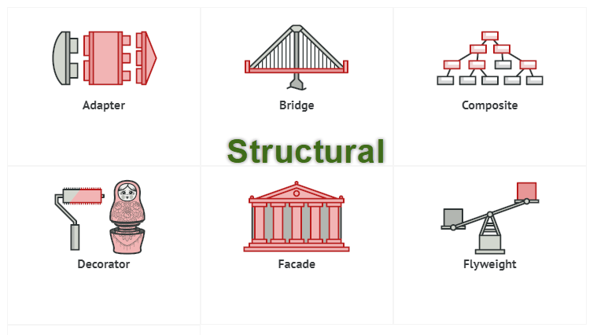

# Structural Patterns

**Mẫu thiết kế nhóm cấu trúc** là những mẫu liên quan tới class và các thành phần của object. Nó dùng để thiết lập, định nghĩa các quan hệ của đối tượng.

Bao gồm 7 mẫu thiết kế, chúng là:
- Adapter
- Bridge
- Composite
- Decorator
- Facade
- Flyweight
- Proxy