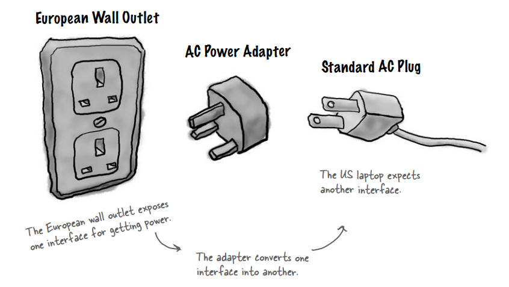
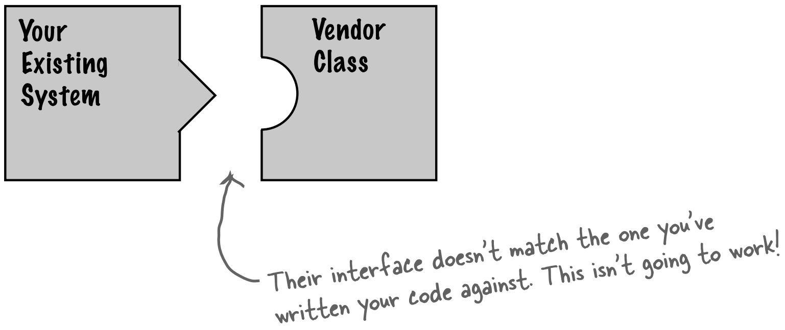
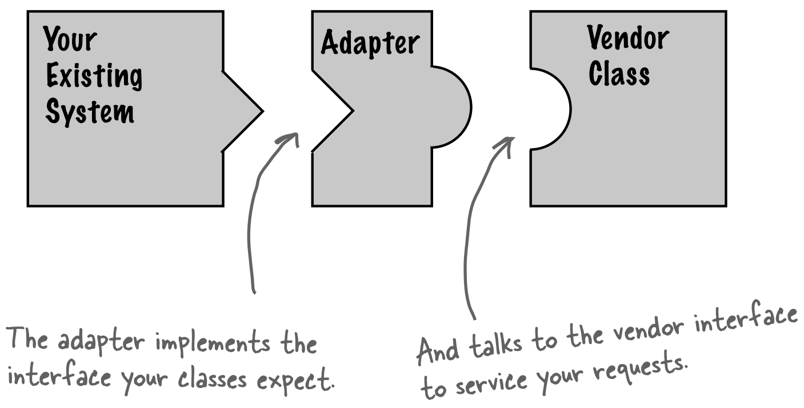
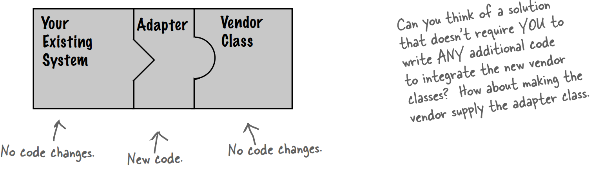
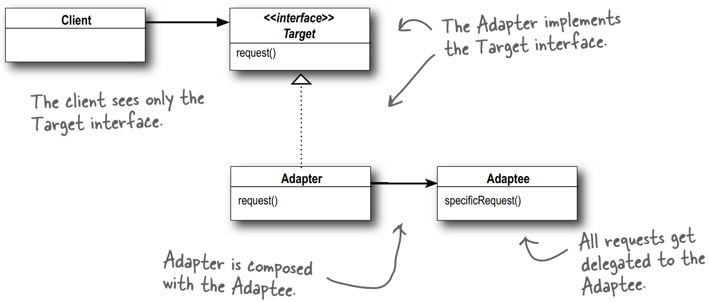
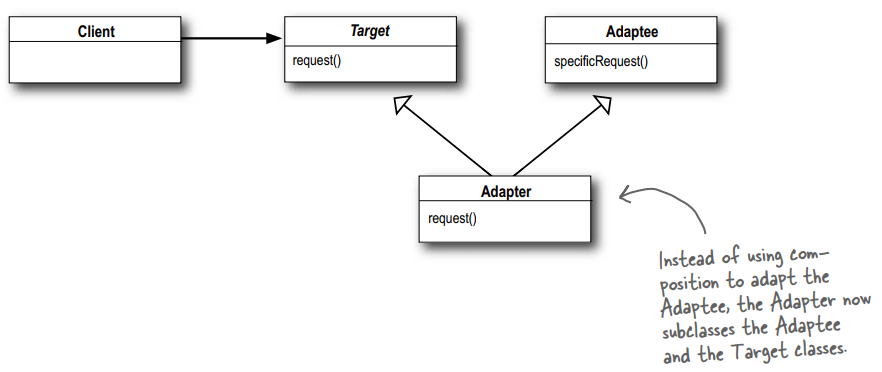

# Adapter

Status: Done
Type: Structural


# Định nghĩa

**Adapter patterns** (bộ chuyển đổi) đóng vai trò trung gian giúp chuyển đổi interface của một lớp sang lớp khác, cho phép các đối tượng có interface không tương thích làm việc với nhau.

# Liên hệ đời sống

Để dễ hình dung, mình sẽ lấy một ví dụ thực tế như sau: Bạn là một nhân viên trong công ty vừa được cử đi onsite tại nước Đức. Tới nơi, bạn lôi laptop ra để sạc pin và nhận ra là ổ điện của nước Đức không khớp với nguồn sạc laptop của bạn. Khi đó, bạn cần một bộ chuyển đổi nguồn để có thể sử dụng được ổ sạc, và cổng chuyển đổi đó chính là _adapter._



cổng chuyển đổi ổ sạc từ 2 chân sang 3 chân

# Bài toán thực tế

Giả sử hệ thống bán hàng thương mại điện tử hiện tại của bạn đang tích hợp cổng thanh toán tên là A-pay. Tuy nhiên, vì một lí do nào đó, công ty lại quyết định thay đổi sang cổng thanh toán B-pay. Vấn đề sinh ra bởi hệ thống hiện tại của bạn không khớp với interface mà cổng thanh toán mới cung cấp (do đang khớp với cổng cũ):



hệ thống hiện tại không khớp với giao diện nhà cung cấp

Bạn không thể yêu cầu nhà cung cấp thay đổi code để nó khớp với hệ thống của bạn được. Bạn cũng không muốn thay đổi code hiện tại của mình bởi nó sẽ tốn khá nhiều thời gian. Vậy bạn nên làm gì?

# Giải pháp

Đây là lúc mà mẫu _adapter_ thể hiện khả năng của mình. Tất cả những gì bạn cần làm là tạo ra một đối tượng _adapter_ nhằm chuyển đổi interface của cổng cũ (A-pay) để tương thích với cổng mới (B-pay).



adapter trung gian giúp kết nối giao diện hệ thống và giao diện nhà cung cấp

Khi đó, bạn chỉ cần viết thêm code mới chứ không cần phải sửa code cũ, không còn phải lo việc chương trình bị phá hỏng khi thay đổi code.



# Cấu trúc

Một Adapter bao gồm các thành phần cơ bản sau:

- **Adapter**: lớp trung gian có nhiệm vụ giúp interface _Adaptee_ tích hợp được với _Target_
- **Adaptee**: lớp có interface đang không tương thích, cần được tích hợp vào
- **Target**: một interface chứa các chức năng được sử dụng bởi Client
- **Client**: lớp này chỉ tương tác với interface _Target_

Trên thực tế có hai loại adapter là **Object adapter** và **Class adapter:**

### Object adapter



sơ đồ của object adapter

Luồng hoạt động của mô hình trên lần lượt theo thứ tự như sau:

1. **Client** tương tác trực tiếp với interface **Target**
2. **Adapter** implement interface **Target** đó
3. **Adapter** chuyển đổi các yêu cầu của interface **Target** sang các yêu cầu tương ứng tại **Adaptee**
4. **Adaptee** nhận được những yêu cầu trên và bắt đầu thực thi

### Class adapter



sơ đồ của class adapter

Như bạn thấy, điểm khác biệt duy nhất giữa **object adapter** và **class adapter** là Adapter phải kế thừa cả **Target** và **Adaptee**, tức _đa kế thừa._

# Cài đặt

Giả sử bạn vừa lập trình ra một người máy có khả năng nói ngược (mã hóa ngôn ngữ). Để hiểu được nó nói gì, ta cần viết một chương trình biên dịch nhằm chuyển đổi ngôn ngữ của nó. Chương trình đó sẽ được triển khai theo mẫu _class_ _adapter_ như sau:

- **Client** (human): người bình thường
- **Target** (human-language): ngôn ngữ loài người
- **Adapter** (translator): máy phiên dịch nhận thông điệp từ người máy và chuyển đổi nó sang ngôn ngữ loài người
- **Adaptee** (bot-language): ngôn ngữ đảo ngược

**client.ts**

```tsx
function clientCode(target: Target) {
  consle.log(target.request());
}
```

**adapter.ts**

```tsx
class Adapter extends Target {
  private adaptee: Adaptee;

  constructor(adaptee: Adaptee) {
    super();
    this.adaptee = adaptee;
  }
  // Override
  public request(): string {
    const result = translate();
    return `Adapter (translator): (TRANSLATED) ${result}`;
  }

  private translate(): string {
    return this.adaptee.specificRequest().split("").reverse().join("");
  }
}
```

**adaptee.ts**

```tsx
class Adaptee {
  public specificRequest(): string {
    return "!hniM mI olleH";
  }
}
```

**target.ts**

```tsx
class Target {
  public request(): string {
    return "Target (human-language): Hello Im Minh!";
  }
}
```

**index.ts**

```tsx
console.log("Client (human): I use Target language:");
const target = new Target();
clientCode(target);

console.log("");

const adaptee = new Adaptee();
console.log(
  "Client (human): The Adaptee has a weird language. See, I don't understand it:"
);
console.log(`Adaptee (bot): ${adaptee.specificRequest()}`);

console.log("");

console.log("Client (human): But I can understand with it via the Adapter:");
const adapter = new Adapter(adaptee);
clientCode(adapter);
```

**Output:**

```
Client (human): I use Target language
Target (human-language): Hello Im Minh!
Client (human): The Adaptee has a weird language. See, I don't understand it:
Adaptee (bot-language): !hniM mI olleH

Client (human): But I can understand with it via the Adapter:
Adapter (translator): (TRANSLATED) Hello Im Minh!
```

# Ưu nhược điểm

## Ưu điểm

1. Tuân thủ nguyên tắc S (**S**ingle Responsibility*)* trong SOLID. Bạn có thể tách riêng phần code interface hoặc code chuyển đổi dữ liệu ra để phát triển.
2. Tuân thủ nguyên tắc O (**O**pen/Closed) trong SOLID. Bạn có thể thoải mái sử dụng các loại _adapter_ mới cho chương trình mà không sợ phá hỏng chương trình hiện tại.

## Nhược điểm

1. Độ phức tạp của code tăng lên bởi vì bạn phải dùng thêm các class và interface mới. Đôi khi việc thay đổi code cũ sẽ tốt hơn là sử dụng _adapter._

# Mối liên hệ với các mẫu khác

- **Bridge** thường được thiết kế trước, cho phép bạn phát triển các phần của ứng dụng một cách độc lập. Còn **Adapter** thì thường được dùng với ứng dụng đã có sẵn nhằm kết nối, giúp các lớp hoạt động với nhau một cách hoàn hảo.
- **Facade** sẽ tạo interface mới dựa trên đối tượng hiện có, trong khi **Adapter** lại tìm cách để khiến interface hiện tại sử dụng được tiếp.
- **Adapter** thay đổi interface của đối tượng hiện có, còn **Decorator** nâng cấp một đối tượng mà không thay đổi interface của nó. Ngoài ra **Decorator** có hỗ trợ đệ quy composition, còn **Adapter** thì không.
- Interface được cung cấp bởi các mẫu là khác nhau: **Adapter** cung cấp một mẫu mới khác hoàn toàn, **Proxy** cung cấp mẫu y hệt mẫu cũ, còn **Decorator** cung cấp một mẫu cải tiến hơn
- **Bridge**, **State**, **Strategy** (đôi khi là **Adapter**) có cùng kiểu mẫu cấu trúc giống nhau. Tất cả các mẫu này đều dựa trên composition - tức là ủy thác công việc cho đối tượng khác. Tuy nhiên, chúng được sử dụng để giải quyết các bài toán khác nhau.
